# LyraApp - Modern Medya Deneyimi

LyraApp, yüksek performanslı ve kullanıcı dostu bir müzik dinleme deneyimi sunmak amacıyla geliştirilmiş, modern Android teknolojilerini (Jetpack Compose, Media3, MVI) temel alan bir mobil uygulamadır. Hem çevrimiçi akış hem de gelişmiş çevrimdışı oynatma yeteneklerine sahiptir.

##  Öne Çıkan Özellikler

- **Çift Modlu Oynatma:** RESTful API üzerinden anlık akış (streaming) ve yerel depolama üzerinden internet gerektirmeyen çevrimdışı dinleme.
- **Media3 & ExoPlayer Entegrasyonu:** Kesintisiz ses geçişleri, arka planda oynatma ve sistem düzeyinde medya kontrolleri.
- **Dinamik Çalma Listeleri:** Kullanıcıya özel kütüphane yönetimi, çalma listesi oluşturma ve favorilere ekleme.
- **Akıllı Arama:** Sanatçı ve şarkı bazlı, hızlı sonuç veren arama modülü.
- **Modern Görünüm:** Material 3 standartlarına uygun, kullanıcı odaklı ve estetik arayüz.
- **Abonelik Yönetimi:** Premium özellikler ve kullanıcı profili kişiselleştirme.

##  Ekran Görüntüleri

| Ana Sayfa |                   Şimdi Çalıyor                    |                      Kütüphane                      |
| :---: |:--------------------------------------------------:|:---------------------------------------------------:|
| 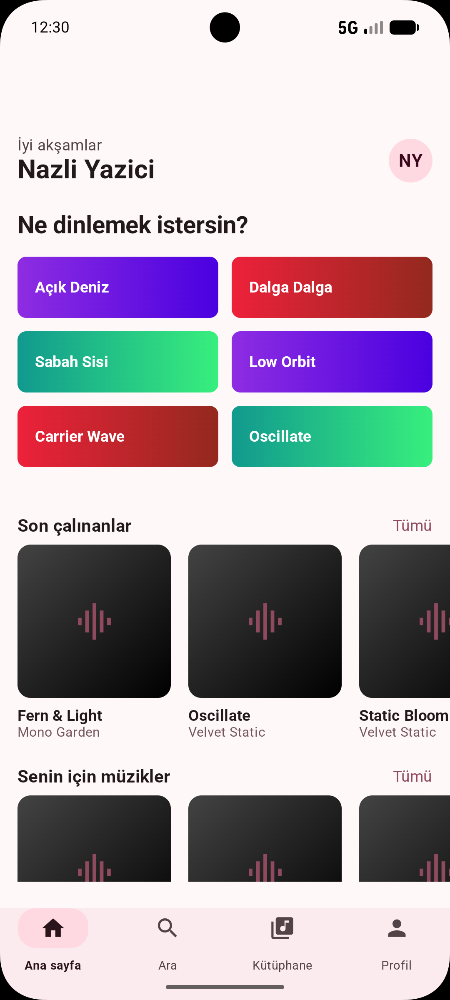 | 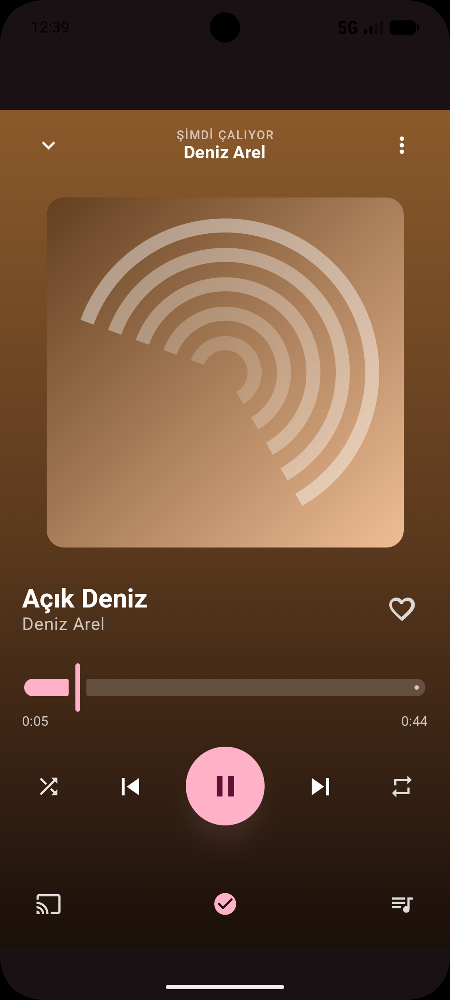 | 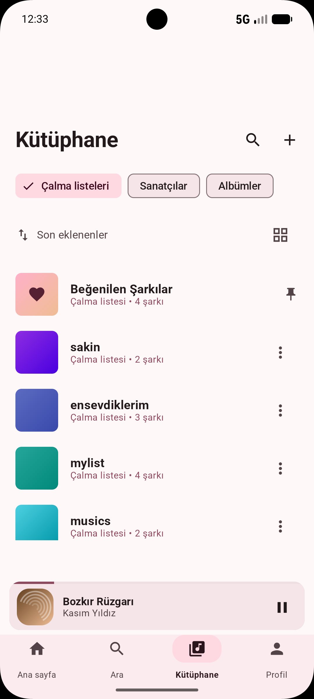 |

|                 Arama & Keşfet                 |                 Profil Ayarları                  |                      Çalma Listesi Detay                       |
|:----------------------------------------------:|:------------------------------------------------:|:--------------------------------------------------------------:|
| 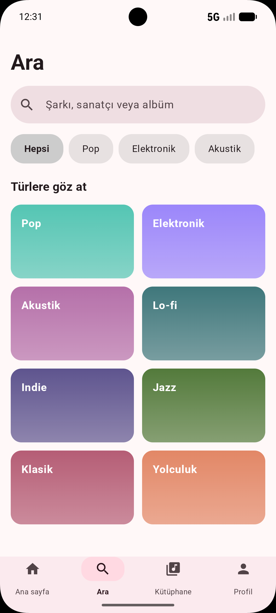 | 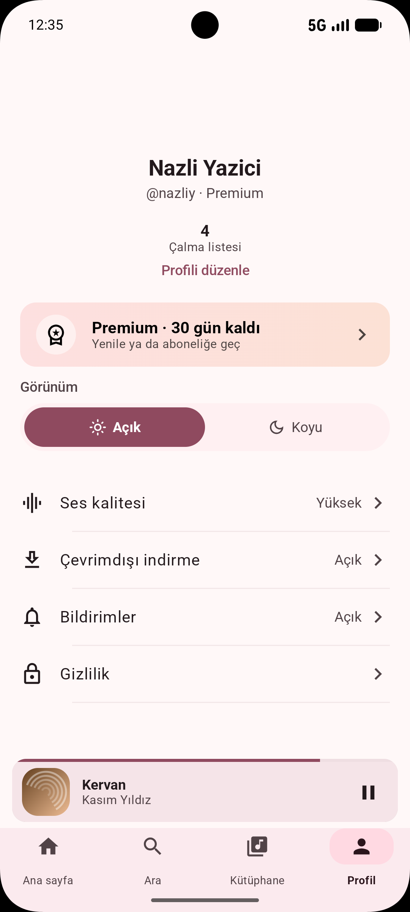 | 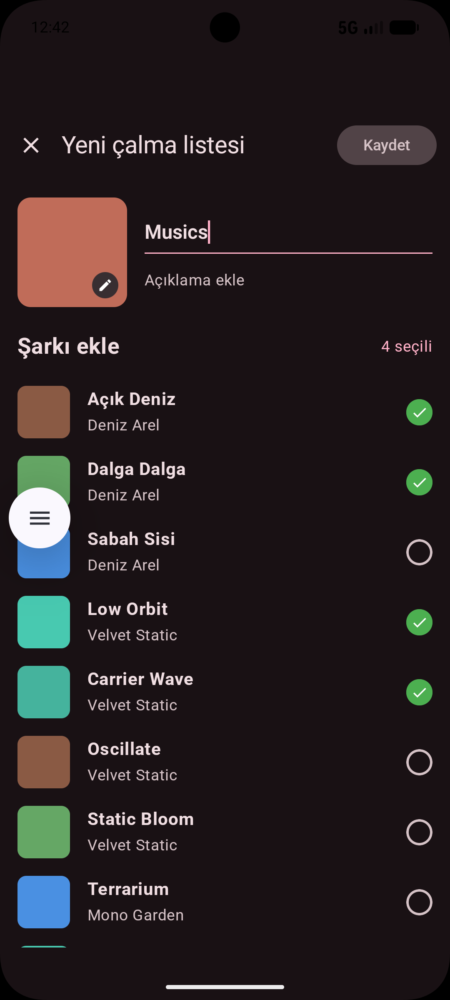 |

|                       Favoriler                       |                  Ödeme Ekranı                   |                  Premium Özellik                  |
|:-----------------------------------------------------:|:-----------------------------------------------:|:-------------------------------------------------:|
| 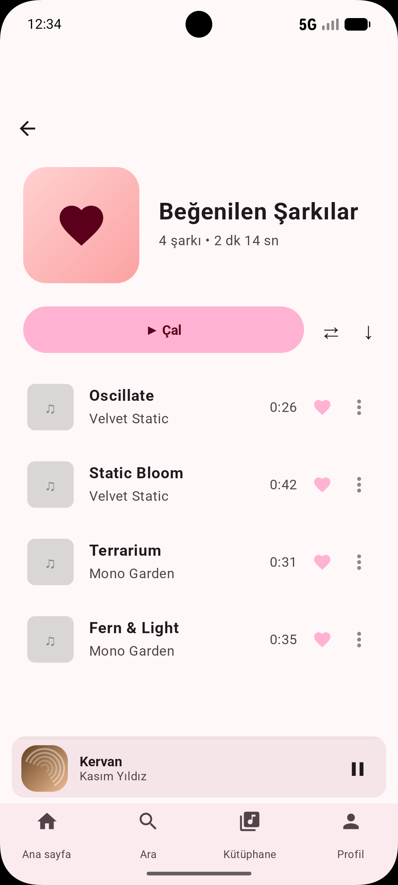 | 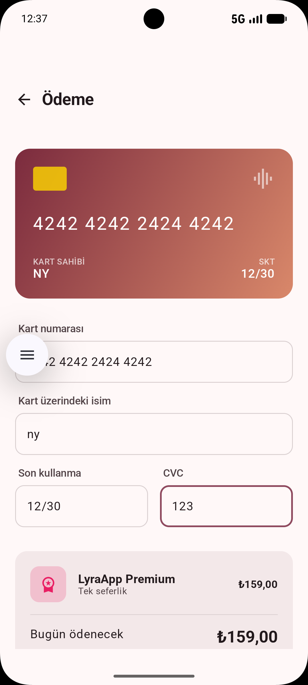 | 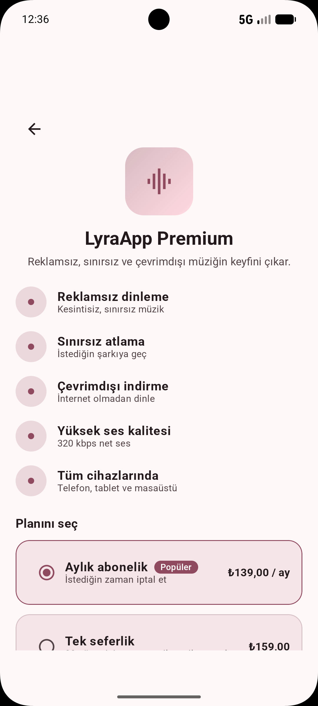 |

|                       Bildirim Ekranı                        |                     Giriş                     |                        Dark Mode                        |
|:------------------------------------------------------------:|:---------------------------------------------:|:-------------------------------------------------------:|
| 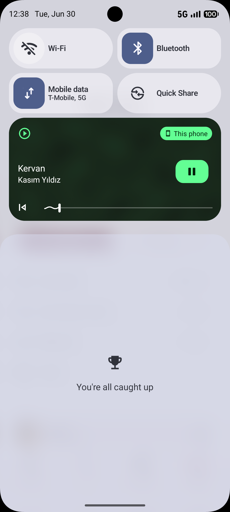 | 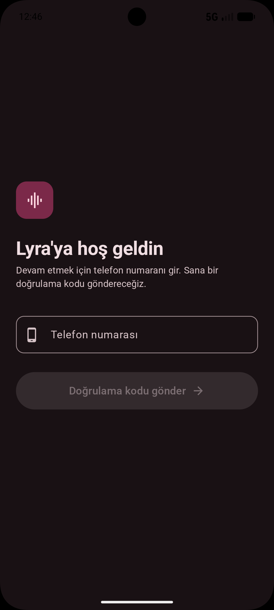 | 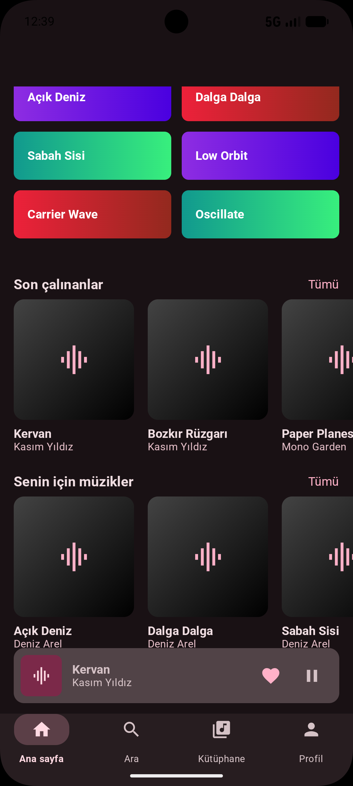 |
## Teknik Yığın (Tech Stack)

- **UI:** Jetpack Compose (Material 3)
- **Mimari:** MVI (Model-View-Intent) & Clean Architecture prensipleri
- **Dependency Injection:** Dagger Hilt
- **Medya Motoru:** Media3 (ExoPlayer, MediaSession)
- **Ağ:** Retrofit 2 & OkHttp 4
- **Veri Saklama:** 
  - **Preferences:** Jetpack DataStore
  - **Offline Files:** Internal Storage (Internal Storage/downloads)
- **Eşzamanlılık:** Kotlin Coroutines & Flow

##  Mimari Yapı (MVI)

LyraApp, ölçeklenebilirlik ve test edilebilirlik için **MVI (Model-View-Intent)** mimarisini kullanır. Veri akışı tek yönlüdür (UDF):

1.  **State:** Ekranın tüm verisini içeren tek bir immutable (değişmez) sınıf.
2.  **Intent:** Kullanıcının gerçekleştirdiği tüm eylemler (tıklama, yazma vb.).
3.  **Effect:** Navigasyon veya Toast gibi tek seferlik UI olayları.

### Katmanlar:
- **UI Katmanı:** Compose fonksiyonları ve UI Logic (ViewModel).
- **Data Katmanı:** API servisleri, Repository implementasyonları ve DataSource.
- **Service Katmanı:** Media3 `MediaSessionService` entegrasyonu ile arka plan medya yönetimi.

## Proje Klasör Yapısı

```text
com.example.lyraapp/
├── data/           # API modelleri, Repositoryler ve Network modülleri
├── di/             # Hilt Dependency Injection modülleri
├── service/        # LyraMediaService ve Medya Kontrolcüleri
├── ui/             # Ekranlar ve UI bileşenleri (Her modül MVI ile ayrılmıştır)
│   ├── auth/       # Kayıt ve Giriş işlemleri
│   ├── home/       # Ana sayfa ve keşfet akışı
│   ├── player/     # Oynatıcı kontrolleri ve ses motoru yönetimi
│   └── ...         # Diğer özellik modülleri
└── MainActivity.kt # Ana giriş ve Navigasyon Host
```

##  Kurulum ve Çalıştırma

1.  Repository'yi klonlayın: `git clone https://github.com/username/LyraApp.git`
2.  Android Studio ile açın.
3.  Projeyi senkronize edin ve bir emülatör/cihaz üzerinde `Run` tuşuna basın.

---
*Bu proje, modern Android geliştirme standartlarını ve temiz kod prensiplerini sergilemek amacıyla hazırlanmıştır.*
